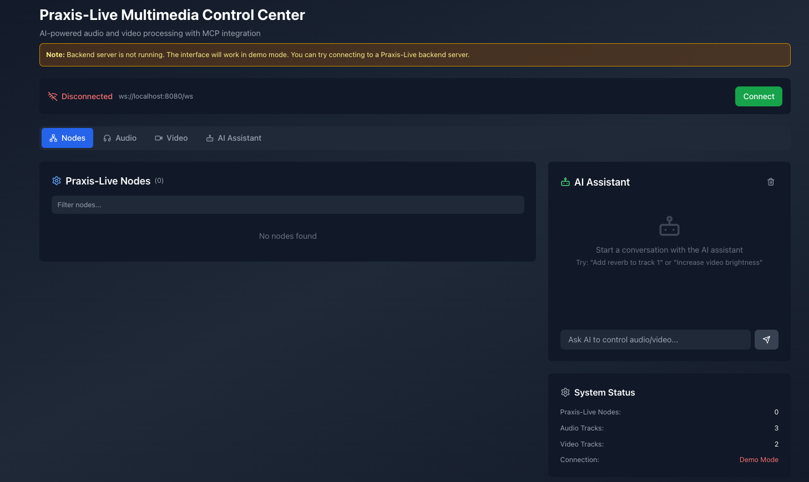

# mcp-praxis-live
A frontend with MCP server for Praxis-Live. A work in progress, currently working on the API and connection to the Java backend.

'''

<h2>Key Features:</h2>
<h3>🤖 <strong>Intelligent AI Assistant</strong></h3>
<ul>
<li><strong>Natural Language Processing</strong>: Understands commands like "increase volume of track 1 to 80" or "make the video brighter"</li>
<li><strong>Context Awareness</strong>: Knows the current state of all audio/video tracks and nodes</li>
<li><strong>Action Execution</strong>: Automatically applies changes to your multimedia controls</li>
</ul>
<h3>🔧 <strong>Smart Integration</strong></h3>
<ul>
<li><strong>Real-time Control</strong>: AI commands directly update sliders and controls</li>
<li><strong>Multi-modal Support</strong>: Controls audio, video, and Praxis-Live nodes</li>
<li><strong>Action Feedback</strong>: Shows exactly what changes were made</li>
</ul>
<h3>⚙️ <strong>Configuration Options</strong></h3>
<ul>
<li><strong>API Key Management</strong>: Built-in settings to configure your OpenAI API key</li>
<li><strong>Demo Mode</strong>: Works without API key using pattern matching</li>
<li><strong>Secure Storage</strong>: API keys stored locally for convenience</li>
</ul>
<h3>💬 <strong>Enhanced Chat Interface</strong></h3>
<ul>
<li><strong>Visual Feedback</strong>: Shows processing status and action results</li>
<li><strong>Command History</strong>: Keeps track of all interactions</li>
<li><strong>Error Handling</strong>: Graceful fallbacks when API is unavailable</li>
</ul>
<h2>How to Use:</h2>
<ol>
<li><strong>Get an OpenAI API Key</strong>: Visit <a href="https://platform.openai.com/api-keys" target="_blank">OpenAI Platform</a></li>
<li><strong>Configure the Key</strong>: Click the settings icon in the AI chat and enter your key</li>
<li><strong>Start Chatting</strong>: Try commands like:
<ul>
<li>"Set volume of master audio to 90"</li>
<li>"Increase video brightness by 30"</li>
<li>"Mute all audio tracks"</li>
<li>"Make the video more saturated"</li>
</ul>
</li>
</ol>
<h2>Example Commands:</h2>
<ul>
<li><strong>Audio</strong>: "Turn up track 2", "Mute the master", "Set pan to center"</li>
<li><strong>Video</strong>: "Brighten the main video", "Reduce opacity to 50%", "Increase contrast"</li>
<li><strong>Complex</strong>: "Make track 1 louder and pan it left while brightening the video"</li>
</ul>

The AI assistant now provides intelligent, context-aware control over your entire multimedia system with natural language commands!

'''
